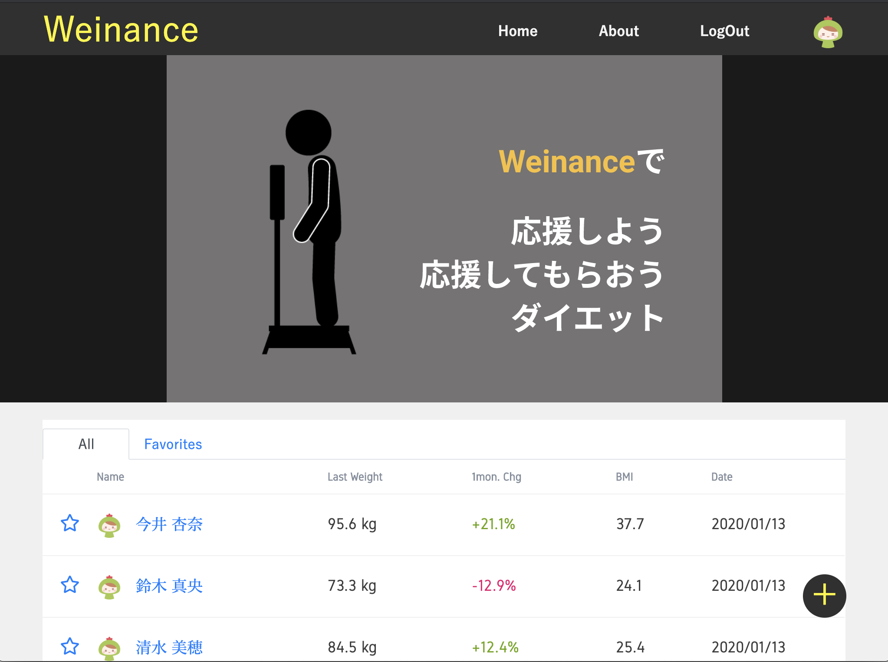
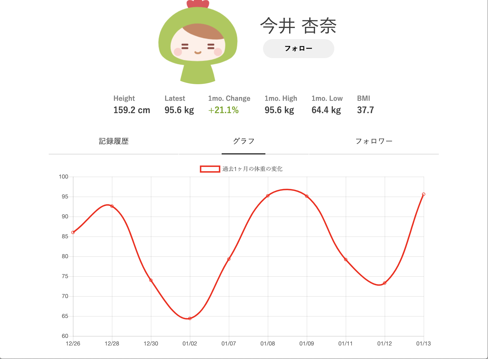

## Weinanceの概要
Web上で体重を記録し、共有できるサービスです。
楽しみながらダイエットができることを目指して作成しました。

## URL
https://weinance.xyz/

ログイン画面からテストユーザーでログインが可能です。

## 実装機能

### ユーザー関連
* ユーザー登録（確認メール送信）、ログイン機能（device）
* Twitter, Facebook, Gooleアカウントによるログイン/ユーザー登録(Omniatuh)
* ajaxを活用したユーザー間でのフォロー、フォロワー機能
* ユーザー情報の編集機能
### 記録関連
* 体重のグラフ表示機能 ( Chart.js )
* 一覧表示機能
* レコードの編集、削除機能
* レコード一覧のページネーション機能(pagy)
### テスト
* RSpec
  * System spec
  * Request spec
### その他
* CircleCIを用いた自動デプロイ機能
* Terraformを用いたインフラのコード化

## 使用技術
* 基本環境
  * Ruby 2.6.3
  * Rails 5.2.3
  * Puma
  * MySQL 5.7
  * Docker
  * docker-compose
  * Git, Github
* フロント技術
  * Sass
  * Bootstrap
  * jQuery
  * Chart.js
* 本番環境
  * CircleCI
  * AWS(ECS, EC2, RDS, VPC, Route53, ALB, ACM)
  * Terraform

## Terraform
awsのインフラをterraformで作成. 
冪等性確保の観点からGPGでローカルで公開鍵を作成し,アクセスキー有りのIAMユーザーもterraformで作成。
tfstateは、amazon S3 のバケットに保存しています。

## AWSアーキテクチャ図

